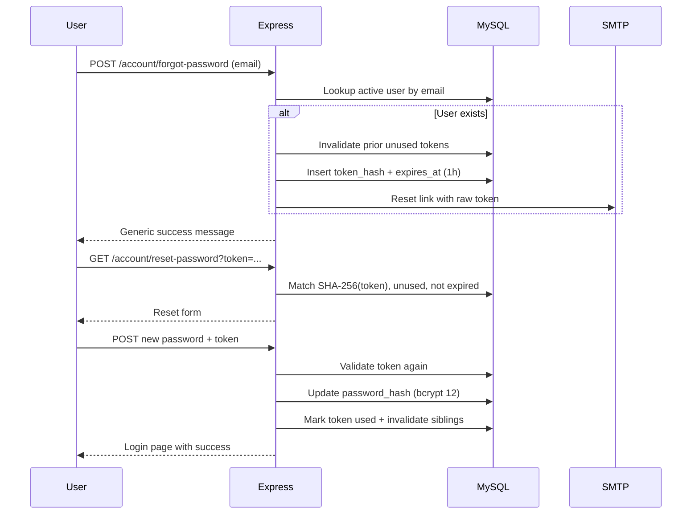

# Password recovery flow

Customer password reset for Medral Health Co storefront accounts (`users` table). Existing login / register / session behaviour is unchanged.

## Routes

| Method | Path | Purpose |
|--------|------|---------|
| GET | `/account/forgot-password` | Request form |
| POST | `/account/forgot-password` | Create token + send email |
| GET | `/account/reset-password?token=` | New password form (validates token) |
| POST | `/account/reset-password` | Consume token + update password |

Login entry: **Forgot password?** on `/account/login`.

## Flow



## Security controls

- **Opaque tokens:** 32 random bytes (64 hex chars); only **SHA-256 hash** stored (`token_hash`)
- **Expiry:** 60 minutes (`expires_at`)
- **One-time use:** `used_at` set on success; sibling unused tokens invalidated
- **Enumeration-safe:** Same response whether email exists
- **Password rules:** Same complexity as register (≥8 chars, letter + number/symbol)
- **CSRF:** Existing global CSRF on POST
- **Rate limit:** `passwordResetLimiter` — 5 requests / 15 minutes
- **Logged-in password change** also invalidates outstanding reset tokens
- **Audit log:** `PASSWORD_RESET_REQUESTED`, `PASSWORD_RESET_REQUESTED_UNKNOWN`, `PASSWORD_RESET_COMPLETED` via `AuditLogger.logAuth`

## Email

Requires SMTP (`SMTP_HOST`, `SMTP_FROM`, …). If SMTP is unset in non-production, the reset URL is logged for local testing.

Reset link shape: `{SITE_URL}/account/reset-password?token={rawToken}`

## Database

Migration: `database/migrations/002_password_reset_tokens.sql`  
Also mirrored in `database/schema.sql`.

```sql
-- Apply on existing DB:
SOURCE database/migrations/002_password_reset_tokens.sql;
```

## Manual test checklist

- [ ] Forgot unknown email → generic success, no email required
- [ ] Forgot known email → email received (or dev log link)
- [ ] Open link → form loads
- [ ] Submit weak password → validation error; token still valid
- [ ] Submit matching strong passwords → redirected to login with success
- [ ] Reuse same token → invalid/expired
- [ ] Expired token (>1h) → invalid
- [ ] Rate-limit 6th POST within 15m → 429
- [ ] Existing login with old password fails; new password works
